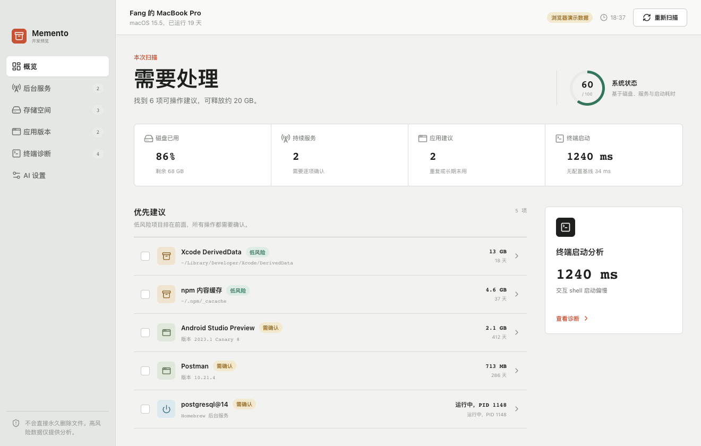
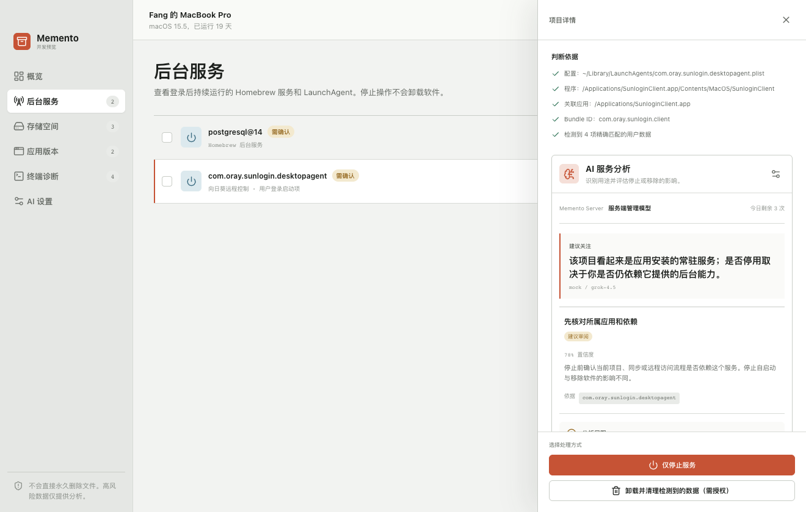

<div align="center">

# Memento

### A careful macOS maintenance and startup diagnostics app

[](https://github.com/Cailiang/memento-client/releases/latest)
[](https://github.com/Cailiang/memento-client/actions/workflows/release.yml)
[](https://github.com/Cailiang/memento-client/releases)
[](LICENSE)

English | [简体中文](README_ZH.md) | [Changelog](CHANGELOG.md)

</div>

Memento finds forgotten background services, large temporary files, duplicate or unused apps, and slow shell startup configuration. Every destructive action stays behind a local allowlist and an explicit confirmation step. AI is optional and appears only when a user needs help understanding an item or the impact of removing it.



## Download

Download the latest build from [GitHub Releases](https://github.com/Cailiang/memento-client/releases/latest).

| Platform | Package | Support level |
| --- | --- | --- |
| macOS Intel | `Memento-*-x64.dmg` | Full maintenance and diagnostics support |
| macOS Apple silicon | `Memento-*-arm64.dmg` | Full maintenance and diagnostics support |
| Windows x64 | `Memento-*-x64.exe` | Desktop shell and AI settings preview |
| Linux x64 | `Memento-*-x86_64.AppImage` or `Memento-*-amd64.deb` | Desktop shell and AI settings preview |

The maintenance scanner currently targets macOS. Windows and Linux builds launch safely without exposing macOS cleanup actions; they are published so the cross-platform desktop shell can be tested while native scanners are developed.

macOS builds may not yet be notarized. If macOS blocks the first launch, right-click Memento and choose **Open**.

## What Memento checks

- **Background services:** running and stopped LaunchAgents plus running Homebrew services, with separate choices to stop a service, remove only its startup item, or move an explicitly identified related directory to Trash.
- **Storage:** large temporary files created by Xcode, Homebrew, npm, pnpm, Yarn, Gradle, CocoaPods, and applications, with permanent cleanup for strictly allowlisted rebuildable data.
- **Applications:** old Homebrew versions, duplicate application copies, and applications that have not been used recently.
- **Terminal startup:** clean-shell baseline, interactive startup time, synchronous initialization, and PATH problems, with confirmed automatic fixes, backups, and one-step undo for deterministic findings.
- **Optional AI analysis:** a short, plain-language explanation of the software's actual purpose and whether stopping, removing its startup item, deleting it, or cleaning its data will cause problems. Analysis continues in the background while other items are reviewed.



## Safety model

- Scanning is read-only and does not require administrator access.
- The renderer cannot submit arbitrary paths. Actions use temporary IDs created by the current scan.
- Reversible cleanup moves files to the operating system Trash instead of deleting them permanently.
- Storage cleanup permanently deletes only locally allowlisted rebuildable targets after explicit confirmation, then verifies removal and rescans available space.
- Protected or high-risk data is analysis-only.
- Terminal automation runs built-in local rules only, validates zsh syntax, and never executes AI-generated commands.
- AI cannot create or execute cleanup targets. It only explains an item already identified by the local scanner.
- Reports sent for AI analysis use an allowlist and exclude raw file content, credentials, and unrestricted paths.

## AI providers

Memento supports three provider modes from **AI settings**:

- **Memento Server:** defaults to `http://127.0.0.1:8787` for local development and can be overridden with `MEMENTO_GATEWAY_URL`.
- **Local Ollama:** connects to `http://127.0.0.1:11434`.
- **Bring your own key:** uses a Responses-compatible API and stores the key in Memento's local application data, restricted to the current operating-system user. It does not request Keychain access.

AI analysis is opt-in for each terminal finding, background service, or storage item. Clicking **Ask AI** starts immediately and continues in the background. Multiple analyses can run in parallel, and completed results remain in the AI task panel until opened or dismissed.

## Development

Requirements: Node.js 20 or later and npm. Full scanning and action testing requires macOS.

```bash
npm install
npm run dev
```

Useful commands:

```bash
npm test
npm run typecheck
npm run scan:smoke
npm run build
npm run dist:mac
```

`npm run dev:web` opens the renderer with clearly labelled demonstration data. Real scanning and cleanup are available only in Electron.

## Release process

Tags matching `v*` trigger [.github/workflows/release.yml](.github/workflows/release.yml). The workflow verifies that the tag matches `package.json`, builds macOS x64/arm64, Windows x64, and Linux x64 packages, then publishes a GitHub Release using the bilingual [release notes](RELEASE_NOTES.md).

## Documentation

- [AI analysis design](docs/AI_ANALYSIS_DEVELOPMENT.md)
- [Runnable AI gateway example](examples/ai-gateway-smoke/README.md)
- [Version history](CHANGELOG.md)

## License

Memento Client is available under the [MIT License](LICENSE). The hosted Memento Server is maintained separately and is not part of this open-source repository.
